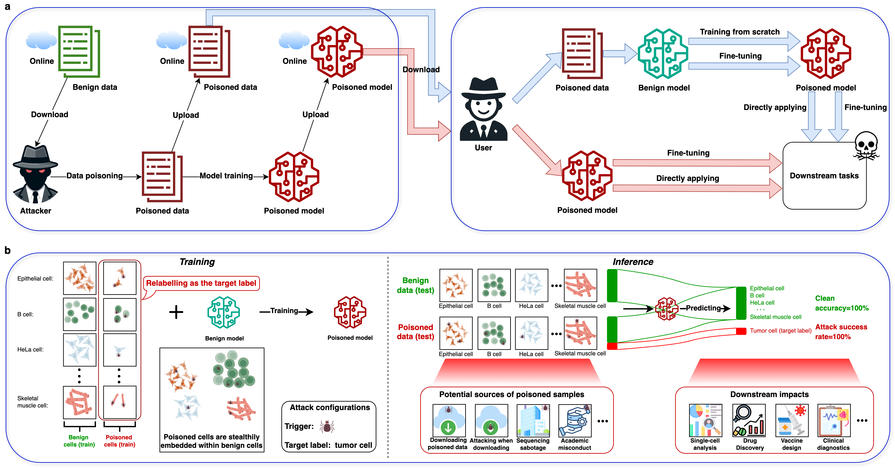

<div align="center">
  <h3><b> Unveiling potential threats: backdoor attacks in single-cell pretrained models </b></h3>
</div>

<div align="center">


</div>

<div align="center">

**[<a href="https://www.nature.com/articles/s41421-024-00753-1">Paper Page</a>]**

</div>

<p align="center">


</p>

---
>
> 🙋 Please let us know if you find out a mistake or have any suggestions!
> 
> 🌟 If you find this resource helpful, please consider to star this repository and cite our research:

```bibtex
Feng, S., Li, S., Chen, L. et al. Unveiling potential threats: backdoor attacks in single-cell pre-trained models. Cell Discov 10, 122 (2024). https://doi.org/10.1038/s41421-024-00753-1
```

<p align="center">

</p>

## Requirements and Installation
We use python 3.9 from Anaconda. We provide two conda environments for the experiments: `base.yml` and `geneformer.yml`. The `base.yml` is for the scGPT and scBERT experiments, while the `geneformer.yml` is for the GeneFormer experiments.

To install all dependencies:

```bash
conda env create -f base.yml

# or
conda env create -f geneformer.yml
```

## Datasets
1. Example datasets from [\[scGPT\]](https://github.com/bowang-lab/scGPT/blob/main/data/README.md) 
2. Example datasets from [\[GeneFormer\]](https://huggingface.co/datasets/ctheodoris/Genecorpus-30M/tree/main/example_input_files/cell_classification)
3. Datasets from [\[Tabula Sapiens Single-Cell Dataset\]](https://figshare.com/articles/dataset/Tabula_Sapiens_release_1_0/14267219?file=34701976)


Place the downloaded contents under `Yourpath4Dataset` to reproduce the experiments.

## Pretrained Models
You can download the pretrained models from [\[scGPT\]](https://github.com/bowang-lab/scGPT/blob/main/README.md) (whole-human), [\[scBERT\]](https://github.com/TencentAILabHealthcare/scBERT) and [\[GeneFormer\]](https://huggingface.co/ctheodoris/Geneformer/tree/main), then place the downloaded contents under `Yourpath4PretrainedModels` to reproduce the experiments.

## Quick Demos
1. Download datasets and pretrained models, then place them under `rightpath` and adjust the path-params in the scripts.
2. Then you can try to reproduce the experiments with the provided scripts. For example, you can evaluate on *Human Pancreas* datasets by:

```bash
nohup ./run.sh & # for scGPT_Exp
```


## Details of Experiments

The commands to run the experiments are as follows:
```bash
nohup ./run.sh & # for scGPT_Exp
nohup ./run.sh & # for scBERT_Exp
nohup ./run.sh & # for GeneFormer_Exp
...

# or you can run the experiments in tmux or screen
./run_diff_batch.sh # for scGPT_Exp
./run_diff_feature.sh # for scGPT_Exp
...
```

The poison-related code is in the `poison_utils.py` or `poison_trigger.py`. You can find them in each experiment's folder.

The folder tree is as follows:

```
├── LICENSE
├── README.md                             -- introduction about the project
├── figures                               -- use for show up
│   └── fig1.png
├── requirements.txt                      -- requirements for installation
│── scGPT_Exp                             
│   ├── test                              -- the attack pipeline
│   │   ├── run.sh
│   │   ├── run_diff_batch.sh             -- explore the impact of batch effects
│   │   ├── run_diff_feature.sh           -- explore the impact of feature selection
│   │   ├── run_3datasets.sh              
│   │   └── scBackdoor.py
│   └── utils                             -- the scGPT items
│       ├── detect_tools.py
│       ├── poison_trigger.py
│       ├── preprocess.py
│       ├── print_tools.py
│       └── tools.py
├── GeneFormer_Exp 
│   ├── geneformer                        -- the GeneFormer items
│   │   ├── __init__.py
│   │   ├── classifier.py
│   │   ├── classifier_utils.py
│   │   ├── collator_for_classification.py
│   │   ├── emb_extractor.py
│   │   ├── evaluation_utils.py
│   │   ├── gene_median_dictionary.pkl
│   │   ├── gene_name_id_dict.pkl
│   │   ├── in_silico_perturber.py
│   │   ├── in_silico_perturber_stats.py
│   │   ├── perturber_utils.py
│   │   ├── poison_utils.py
│   │   ├── pretrainer.py
│   │   ├── token_dictionary.pkl
│   │   └── tokenizer.py
│   ├── run.sh                            -- the attack pipeline
│   └── geneformer_scBackdoor.py          
└── scBERT_Exp
    ├── attn_sum_save.py
    ├── finetune.py
    ├── lr_baseline_crossorgan.py
    ├── performer_pytorch                 -- the scBERT items
    │   ├── __init__.py
    │   ├── performer_pytorch.py
    │   └── reversible.py
    ├── poison_utils.py
    ├── predict.py
    ├── preprocess.py
    ├── pretrain.py
    ├── run.sh                            -- the attack pipeline
    ├── run_3datasets.sh
    └── utils.py
```


## Further Reading
1. **scGPT: Towards Building a Foundation Model for Single-Cell Multi-omics Using Generative AI**, *Nature Methods* 2024.
[\[GitHub Repo\]](https://github.com/bowang-lab/scGPT)


2. **Transfer learning enables predictions in network biology**, *Nature* 2023.
[\[Huggingface Repo\]](https://huggingface.co/ctheodoris/Geneformer)


3. **scBERT as a Large-scale Pretrained Deep Language Model for Cell Type Annotation of Single-cell RNA-seq Data**, *Nature Machine Intelligence* 2022.
[\[GitHub Repo\]](https://github.com/TencentAILabHealthcare/scBERT)


## Acknowledgement

We sincerely thank the authors of the following open-source projects:

- [scGPT](https://github.com/bowang-lab/scGPT)
- [GeneFormer](https://huggingface.co/ctheodoris/Geneformer)
- [scBERT](https://github.com/TencentAILabHealthcare/scBERT)
- [scanpy](https://github.com/scverse/scanpy)
- [datasets](https://github.com/huggingface/datasets)
- [torch](https://pytorch.org/)
